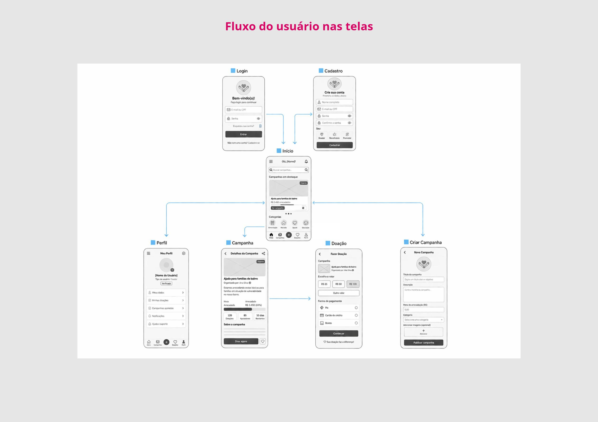
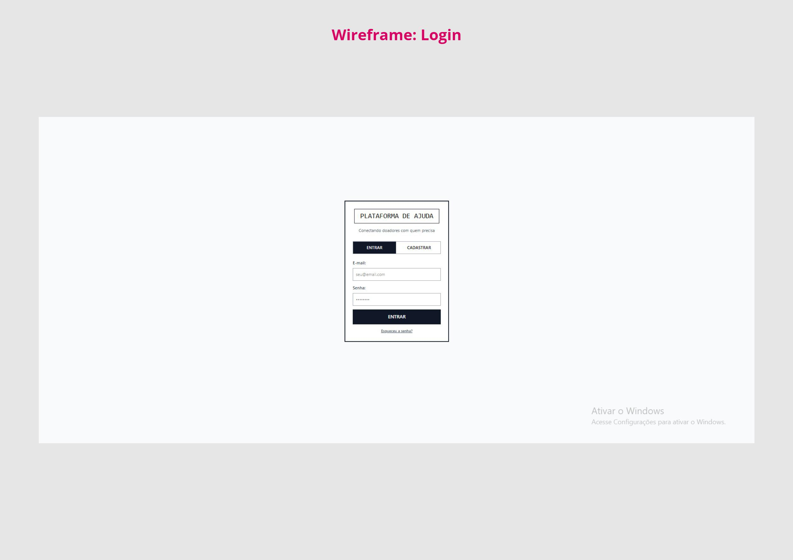
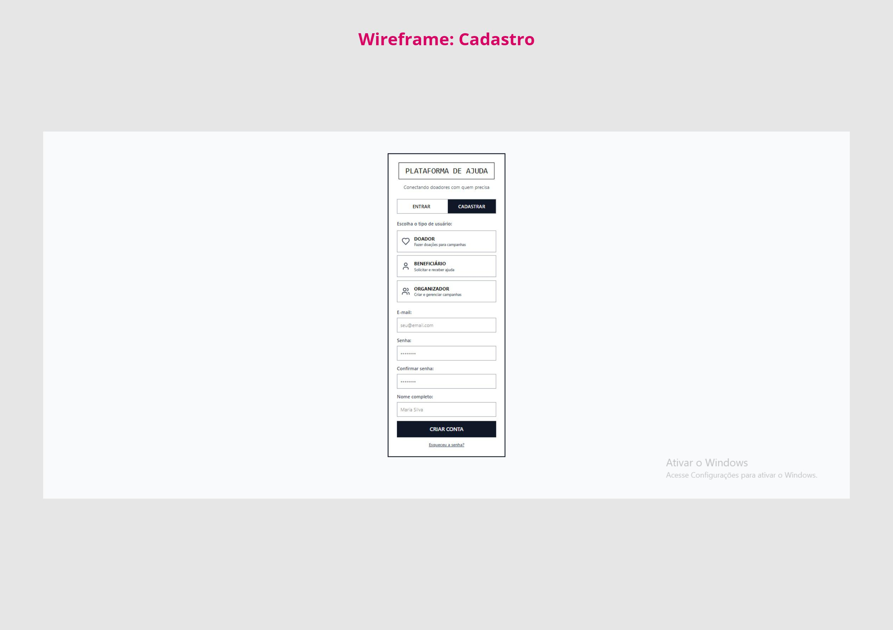
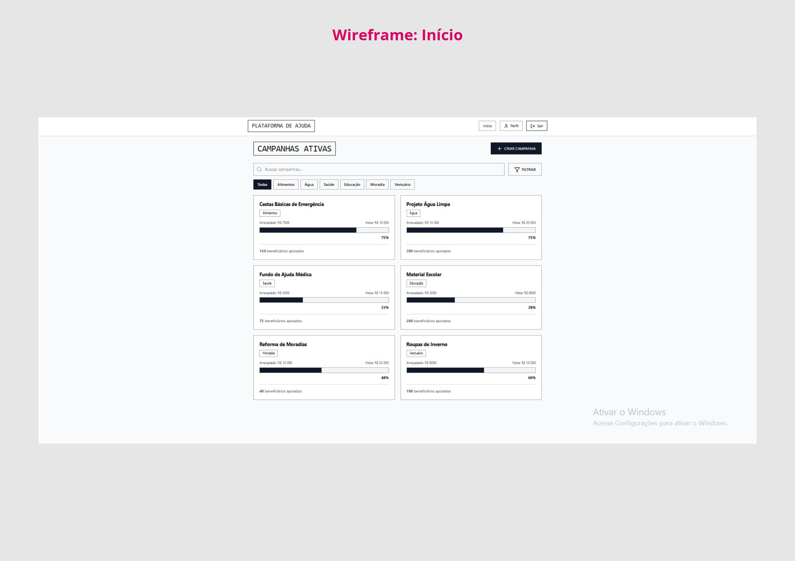
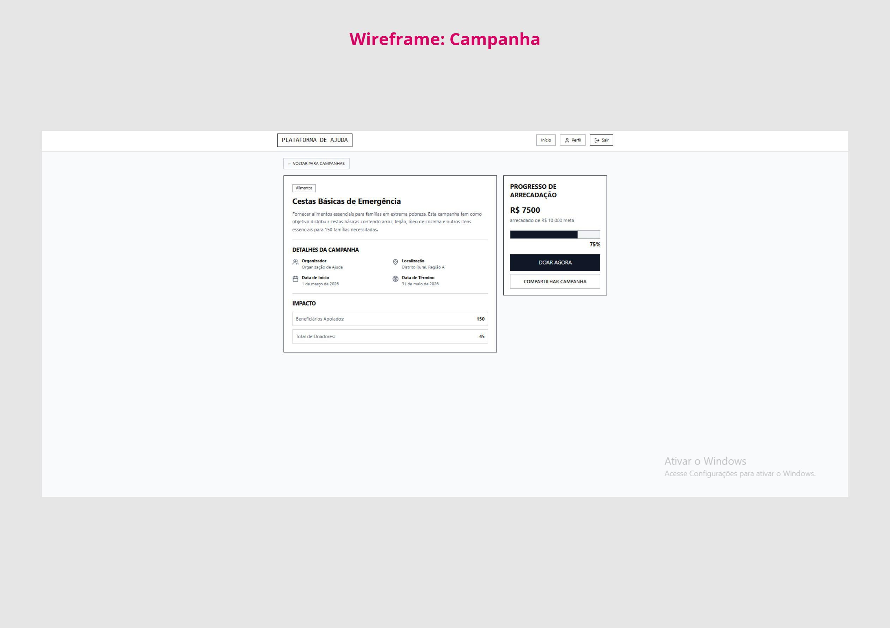
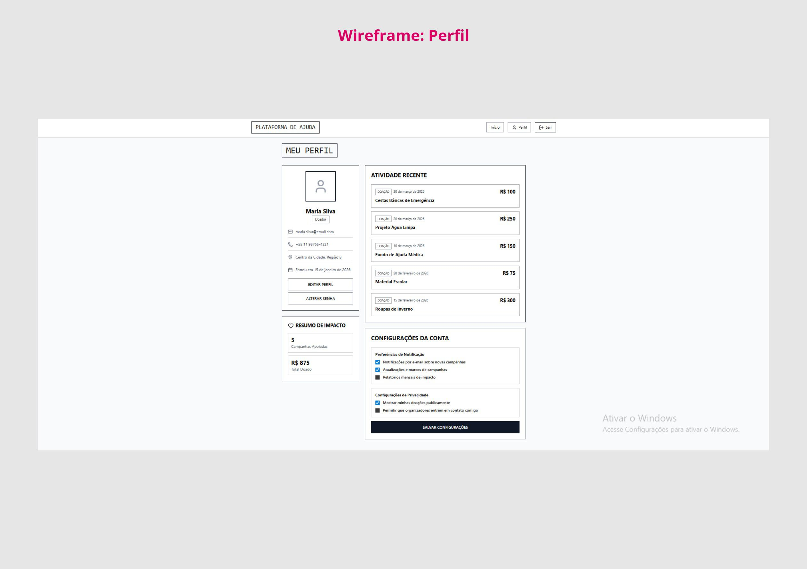
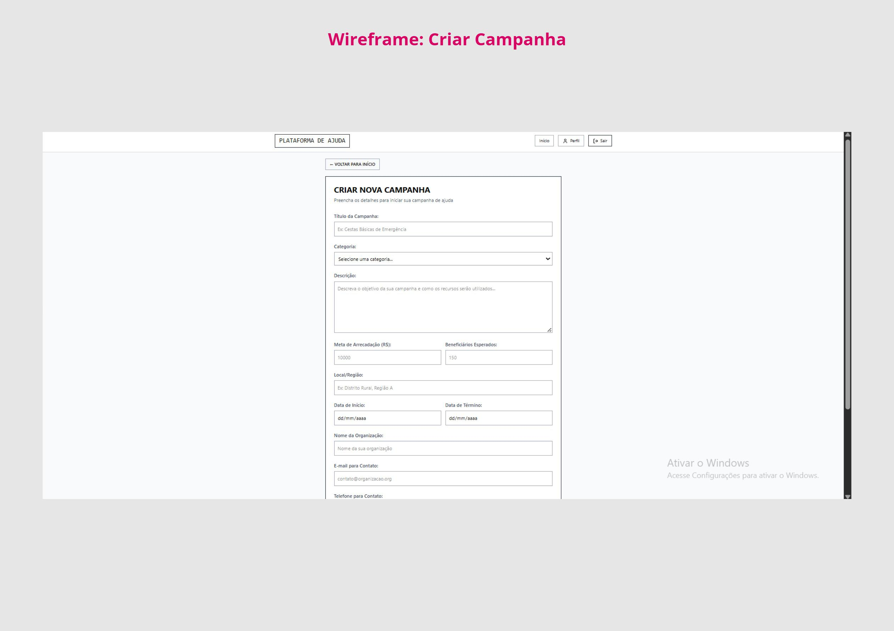
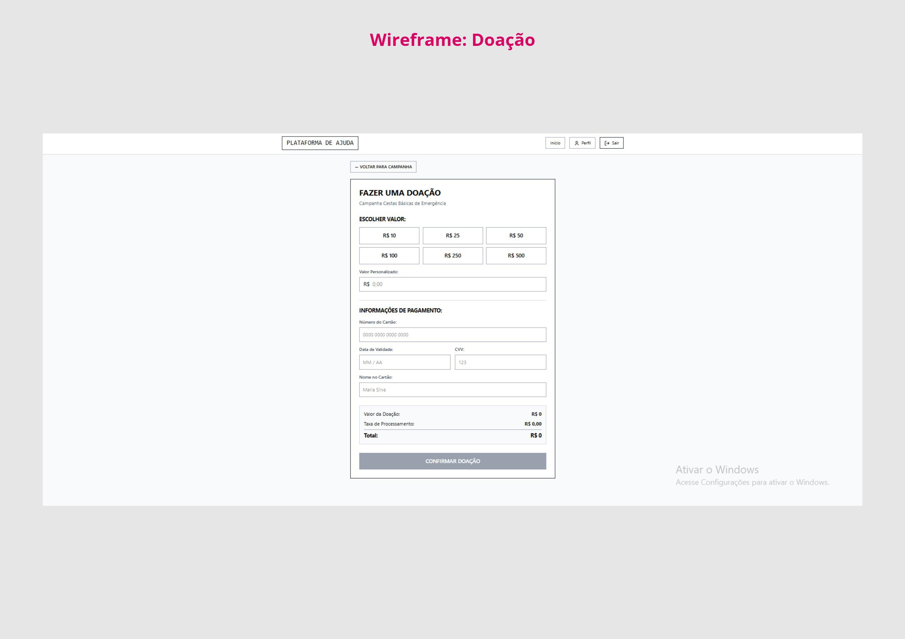

# Solidariza

O objetivo deste projeto é desenvolver uma solução que torne a distribuição de auxílios em áreas de extrema pobreza mais eficiente, transparente e organizada. A proposta busca conectar doadores, promotores e beneficiários em uma única plataforma, facilitando a comunicação, o gerenciamento de recursos e o direcionamento das doações.
Além disso, o projeto pretende garantir maior confiabilidade no processo, permitindo o acompanhamento das doações e assegurando que os recursos cheguem a quem realmente precisa, aumentando o impacto social das iniciativas.

## Alunos integrantes da equipe

* Frederico Marcos de Paula Marques
* Lucas Dutra Figueiredo
* Luiz Felipe Gibim Borges
* Pedro Henrique Rocha
* Alissa Aguiar Fernandes
* Eduardo Andrade Gimenes

## Professore(s) responsável(is)

* Diego
* Lucca
* Henrique

## Contexto

### Problema

A distribuição de auxílios em áreas de extrema pobreza apresenta falhas relacionadas à falta de transparência, organização e conexão entre os envolvidos, como doadores, organizações sociais e beneficiários. Essas dificuldades comprometem a efetividade das ações, fazendo com que recursos nem sempre cheguem a quem realmente necessita, além de favorecerem problemas como má gestão, fraudes e ausência de critérios claros. Soma-se a isso a desconfiança dos doadores e as limitações de acesso à tecnologia por parte dos beneficiários, configurando um cenário fragmentado, com baixa integração e alta complexidade na gestão dos recursos.

### Objetivo do Projeto

O objetivo geral deste trabalho é desenvolver um software voltado à melhoria do processo de distribuição de auxílios em áreas de extrema pobreza. Como objetivos específicos, busca-se analisar os desafios enfrentados pelos envolvidos no processo, investigar formas de organização e gerenciamento das informações, examinar alternativas para acompanhamento das ações e considerar aspectos de acessibilidade, levando em conta as limitações tecnológicas dos beneficiários.

### Justificativa

A escolha do tema se justifica pela relevância social do problema e pelo impacto direto que falhas na distribuição de auxílios causam na efetividade das ações sociais. A falta de transparência, organização e comunicação entre os envolvidos contribui para a desconfiança dos doadores e para a ineficiência no uso dos recursos. Dessa forma, torna-se importante aprofundar a compreensão desses fatores, utilizando dados, pesquisas e análises, a fim de evidenciar as limitações existentes nesse contexto.

### Público-alvo

O público-alvo do projeto é composto por doadores, organizações sociais, promotores de ações solidárias e beneficiários. Os doadores, em geral, possuem maior familiaridade com tecnologia, enquanto as organizações apresentam níveis variados de conhecimento e estrutura hierárquica. Já os beneficiários podem ter acesso limitado a dispositivos e à internet, além de menor familiaridade com ferramentas digitais. Essa diversidade de perfis evidencia a complexidade das relações entre os envolvidos e as dificuldades presentes no processo de distribuição de auxílios.

## Processo de Product Discovery

### Matriz CSD e Mapa de Stakeholders

### Pesquisa e entendimento do problema

A análise de dados e estudos sobre o contexto social brasileiro evidencia que, apesar da expressiva participação da população em ações solidárias, ainda existem limitações relevantes na efetividade da distribuição de auxílios.
De acordo com pesquisas recentes, o Brasil apresenta um volume significativo de doações, com bilhões de reais movimentados anualmente e grande parte da população adulta envolvida em algum tipo de contribuição. Esse cenário demonstra que há disponibilidade de recursos e interesse social em apoiar pessoas em situação de vulnerabilidade.
Por outro lado, o país também possui um número elevado de organizações da sociedade civil atuando na intermediação dessas doações. Embora isso amplie o alcance das ações sociais, também aumenta a complexidade na gestão, no controle e na verificação da destinação dos recursos.
Outro aspecto identificado em estudos é a questão da confiança. Parte dos doadores demonstra preocupação com a transparência das organizações, buscando informações antes de contribuir e, em alguns casos, deixando de doar devido a percepções negativas ou falta de clareza sobre o uso dos recursos.
Além disso, a existência de uma parcela significativa da população em situação de vulnerabilidade social mantém alta a demanda por auxílios, o que exige maior eficiência nos processos de distribuição. Paralelamente, fatores como limitações de acesso à tecnologia por parte de alguns beneficiários também influenciam a forma como esses auxílios são recebidos.
Dessa forma, a pesquisa realizada reforça que o problema não está apenas na disponibilidade de recursos, mas principalmente na forma como esses recursos são organizados, gerenciados e distribuídos, evidenciando a complexidade do contexto analisado.

### Personas e Propostas de Valor

## Processo de Product Design

### Histórias de usuários

## Projeto de Interface

### Fluxo do usuário

### Wireframes

### Protótipo Interativo (Link)

https://www.figma.com/make/fIm3AxWslWkKpT7ASw6uK3/Trabalho-Interdisciplinar

## Metodologia

### Ferramentas

Visual Studio Code
O Visual Studio Code foi utilizado como editor de código principal devido à sua leveza, alta performance e grande variedade de extensões. Essas extensões permitem suporte a diversas linguagens de programação, além de facilitar tarefas como depuração, versionamento e formatação de código. Outro ponto importante é sua integração nativa com o GitHub, o que otimiza o fluxo de desenvolvimento.

WhatsApp e Discord
As ferramentas de comunicação escolhidas foram o WhatsApp e o Discord.
O WhatsApp foi utilizado para comunicações rápidas e alinhamentos do dia a dia, devido à sua praticidade e ampla utilização.
Já o Discord foi utilizado para reuniões, discussões mais detalhadas e compartilhamento de tela, permitindo uma comunicação mais estruturada entre os membros da equipe.

Miro
O Miro foi utilizado como ferramenta de colaboração visual, especialmente nas etapas de Product Discovery e Product Design. Ele possibilita a criação de matriz CSD, mapa de stakeholders, fluxos de usuário e wireframes de forma intuitiva e colaborativa em tempo real, facilitando o alinhamento das ideias entre os integrantes do grupo.

GitHub
O GitHub foi utilizado como plataforma de versionamento de código e gerenciamento do projeto. Ele permite o controle de versões, colaboração entre os membros por meio de commits e pull requests, além de servir como repositório central do projeto.

### Organização da equipe e divisão de papéis

Product Owner (PO): Frederico Marques
Scrum Master: Luiz Felipe
Time de Desenvolvimento: Todos os integrantes da equipe

## Referências Bibliográficas

Instituto para o Desenvolvimento do Investimento Social (IDIS). Pesquisa Doação Brasil 2024. Disponível em: https://www.idis.org.br/publicacoesidis/pesquisa-doacao-brasil-2024/
. Acesso em: abr. 2026.
Instituto de Pesquisa Econômica Aplicada (IPEA). Mapa das Organizações da Sociedade Civil no Brasil. Disponível em: https://mapaosc.ipea.gov.br/
. Acesso em: abr. 2026.
Ministério do Desenvolvimento e Assistência Social. Dados sobre pobreza e programas sociais no Brasil. Disponível em: https://www.gov.br/mds/
. Acesso em: abr. 2026.
Banco Mundial. Poverty and Shared Prosperity Report. Disponível em: https://www.worldbank.org/
. Acesso em: abr. 2026.
Organização das Nações Unidas (ONU). Relatórios sobre pobreza e desigualdade social. Disponível em: https://www.un.org/
. Acesso em: abr. 2026.
DRUCKER, Peter F. Administração de Organizações Sem Fins Lucrativos: Princípios e Práticas. São Paulo: Pioneira, 1994.
KOTLER, Philip; LEE, Nancy. Marketing no Setor Público. Porto Alegre: Bookman, 2008.
LAUDON, Kenneth C.; LAUDON, Jane P. Sistemas de Informação Gerenciais. São Paulo: Pearson, 2014.
PRESSMAN, Roger S. Engenharia de Software: Uma Abordagem Profissional. Porto Alegre: AMGH, 2016.
SOMMERVILLE, Ian. Engenharia de Software. São Paulo: Pearson, 2019.