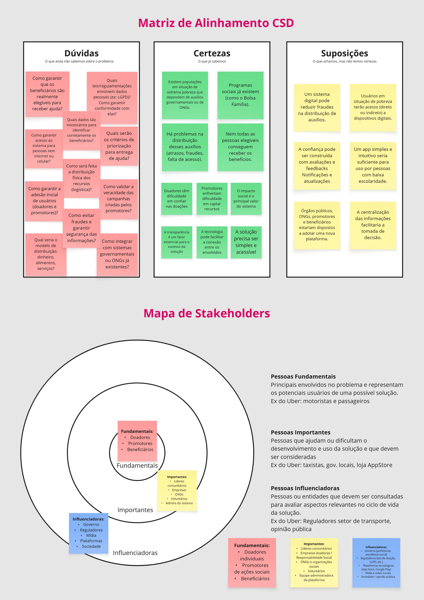
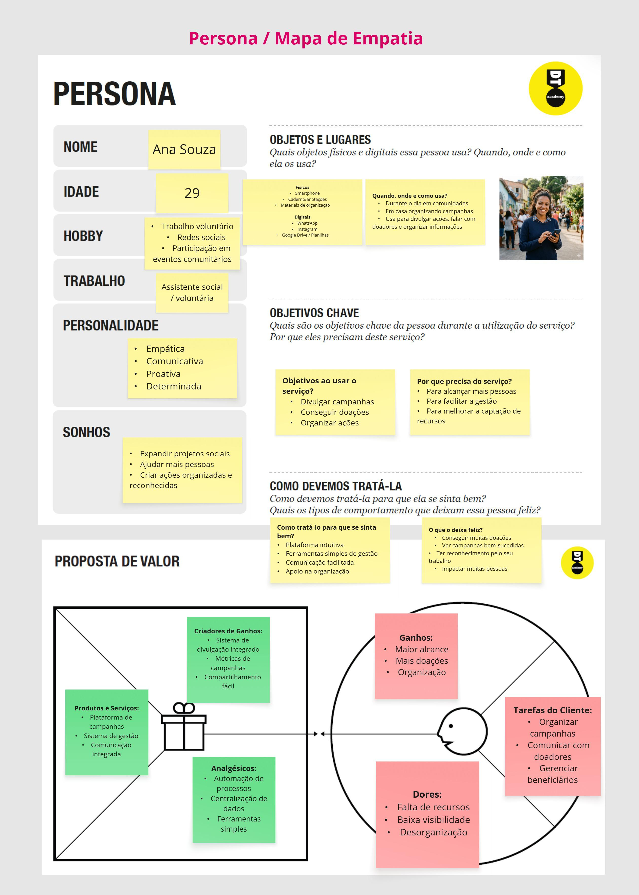
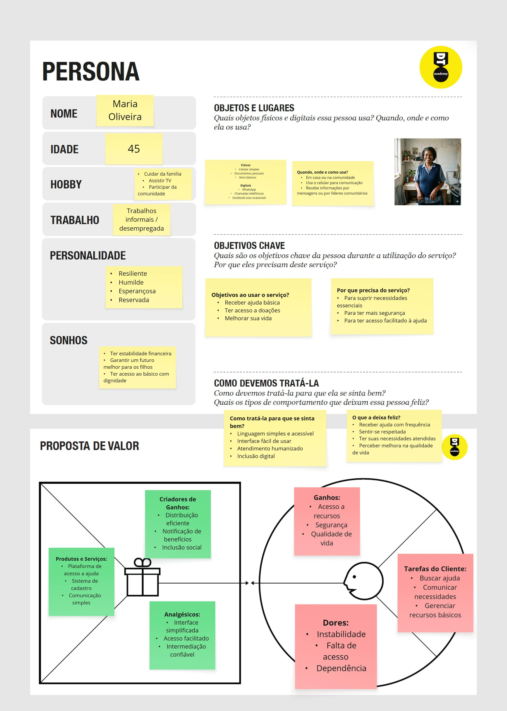
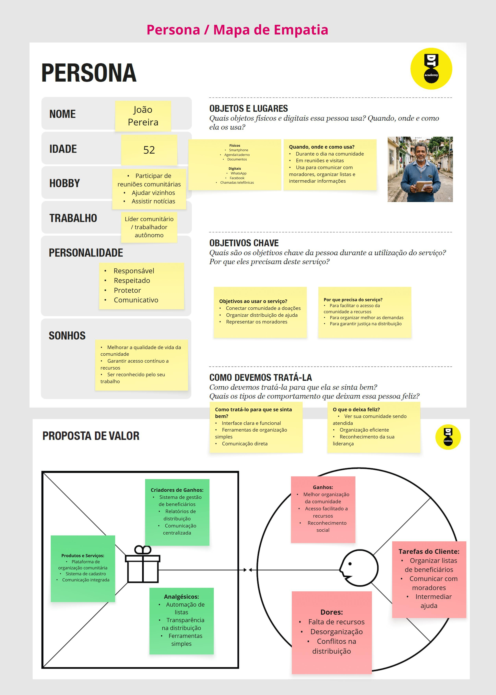
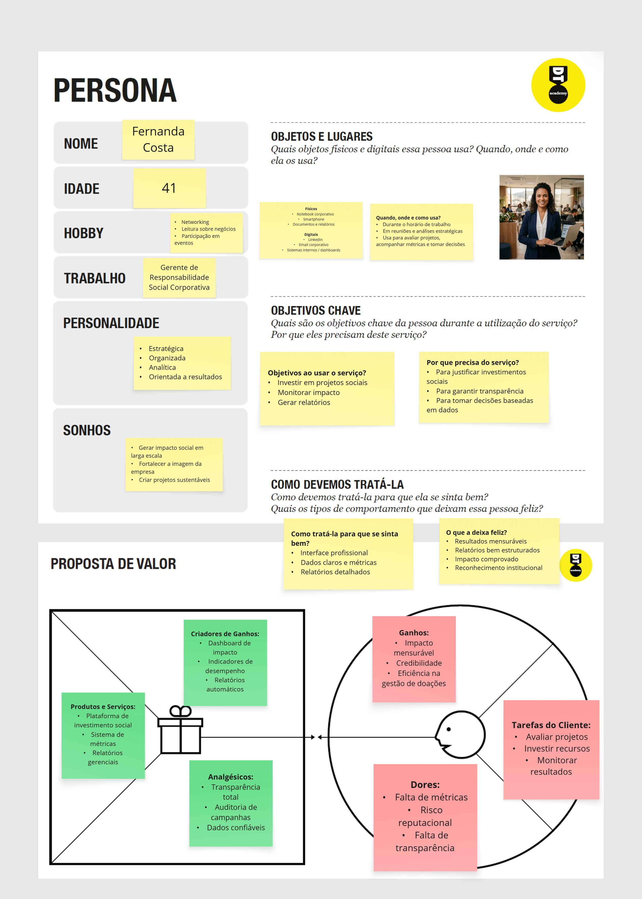
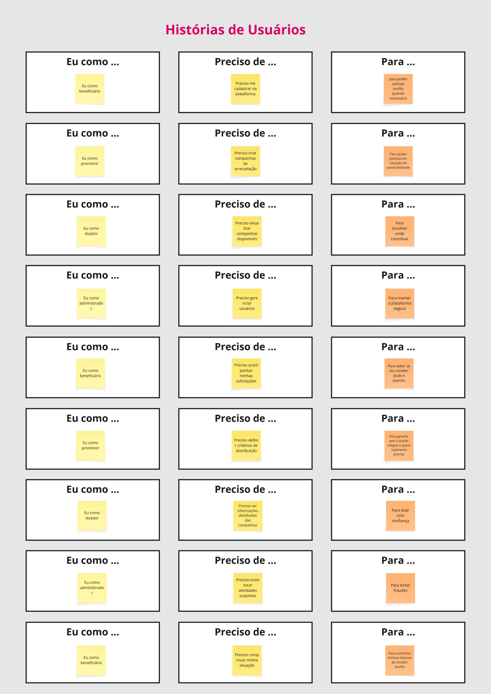

# Solidariza

O objetivo deste projeto é desenvolver uma solução que torne a distribuição de auxílios em áreas de extrema pobreza mais eficiente, transparente e organizada. A proposta busca conectar doadores, promotores e beneficiários em uma única plataforma, facilitando a comunicação, o gerenciamento de recursos e o direcionamento das doações.
Além disso, o projeto pretende garantir maior confiabilidade no processo, permitindo o acompanhamento das doações e assegurando que os recursos cheguem a quem realmente precisa, aumentando o impacto social das iniciativas.

## Alunos integrantes da equipe

* Frederico Marcos de Paula Marques
* Lucas Dutra Figueiredo
* Luiz Felipe Gibim Borges
* Pedro Henrique Rocha
* Alissa Aguiar Fernandes
* Eduardo Andrade Gimenes

## Professore(s) responsável(is)

* Diego
* Lucca
* Henrique

## Contexto

### Problema

A distribuição de auxílios em áreas de extrema pobreza apresenta falhas relacionadas à falta de transparência, organização e conexão entre os envolvidos, como doadores, organizações sociais e beneficiários. Essas dificuldades comprometem a efetividade das ações, fazendo com que recursos nem sempre cheguem a quem realmente necessita, além de favorecerem problemas como má gestão, fraudes e ausência de critérios claros. Soma-se a isso a desconfiança dos doadores e as limitações de acesso à tecnologia por parte dos beneficiários, configurando um cenário fragmentado, com baixa integração e alta complexidade na gestão dos recursos.

### Objetivo do Projeto

O objetivo geral deste trabalho é desenvolver um software voltado à melhoria do processo de distribuição de auxílios em áreas de extrema pobreza. Como objetivos específicos, busca-se analisar os desafios enfrentados pelos envolvidos no processo, investigar formas de organização e gerenciamento das informações, examinar alternativas para acompanhamento das ações e considerar aspectos de acessibilidade, levando em conta as limitações tecnológicas dos beneficiários.

### Justificativa

A escolha do tema se justifica pela relevância social do problema e pelo impacto direto que falhas na distribuição de auxílios causam na efetividade das ações sociais. A falta de transparência, organização e comunicação entre os envolvidos contribui para a desconfiança dos doadores e para a ineficiência no uso dos recursos. Dessa forma, torna-se importante aprofundar a compreensão desses fatores, utilizando dados, pesquisas e análises, a fim de evidenciar as limitações existentes nesse contexto.

### Público-alvo

O público-alvo do projeto é composto por doadores, organizações sociais, promotores de ações solidárias e beneficiários. Os doadores, em geral, possuem maior familiaridade com tecnologia, enquanto as organizações apresentam níveis variados de conhecimento e estrutura hierárquica. Já os beneficiários podem ter acesso limitado a dispositivos e à internet, além de menor familiaridade com ferramentas digitais. Essa diversidade de perfis evidencia a complexidade das relações entre os envolvidos e as dificuldades presentes no processo de distribuição de auxílios.

## Processo de Product Discovery

### Matriz CSD e Mapa de Stakeholders

### Pesquisa e entendimento do problema

A análise de dados e estudos sobre o contexto social brasileiro evidencia que, apesar da expressiva participação da população em ações solidárias, ainda existem limitações relevantes na efetividade da distribuição de auxílios.
De acordo com pesquisas recentes, o Brasil apresenta um volume significativo de doações, com bilhões de reais movimentados anualmente e grande parte da população adulta envolvida em algum tipo de contribuição. Esse cenário demonstra que há disponibilidade de recursos e interesse social em apoiar pessoas em situação de vulnerabilidade.
Por outro lado, o país também possui um número elevado de organizações da sociedade civil atuando na intermediação dessas doações. Embora isso amplie o alcance das ações sociais, também aumenta a complexidade na gestão, no controle e na verificação da destinação dos recursos.
Outro aspecto identificado em estudos é a questão da confiança. Parte dos doadores demonstra preocupação com a transparência das organizações, buscando informações antes de contribuir e, em alguns casos, deixando de doar devido a percepções negativas ou falta de clareza sobre o uso dos recursos.
Além disso, a existência de uma parcela significativa da população em situação de vulnerabilidade social mantém alta a demanda por auxílios, o que exige maior eficiência nos processos de distribuição. Paralelamente, fatores como limitações de acesso à tecnologia por parte de alguns beneficiários também influenciam a forma como esses auxílios são recebidos.
Dessa forma, a pesquisa realizada reforça que o problema não está apenas na disponibilidade de recursos, mas principalmente na forma como esses recursos são organizados, gerenciados e distribuídos, evidenciando a complexidade do contexto analisado.

### Personas e Propostas de Valor

## Processo de Product Design

### Histórias de usuários

> **IMPORTANTE: APAGUE ESSA SEÇÃO DE INSTRUÇÕES ANTES DE ENTREGAR SEU TRABALHO**

No desenvolvimento desse trabalho, o grupo deverá utilizar esse repositório como local para entrega de todos os artefatos a serem produzidos. Em especial, o grupo deverá providenciar a alteração dos seguintes arquivos:

* **Capa do projeto** (Esse arquivo aqui): Informação básica sobre o projeto, alunos do grupo e professores responsáveis;
* **Arquivo CITATION.cff**: descritor do projeto, utilizado para geração do certificado ao final da disciplina.
* **Pasta código**: todos os arquivos resultantes da programação do software.
* **Pasta docs --> arquivo README.md**: Documentação completa do projeto.
* **Pasta video**: video de apresentação do projeto.

Toda a documentação do projeto é estruturada por meio da linguagem Markdown adotada pelo GitHub e por diversas outras plataformas. Aprenda Markdown e use para documentar o projeto:

* [Sintaxe básica de gravação e formatação no GitHub - GitHub Docs](https://docs.github.com/pt/get-started/writing-on-github/getting-started-with-writing-and-formatting-on-github/basic-writing-and-formatting-syntax)
* [Markdown® Básico: Sintaxe, Uso &amp; Exemplos [Passo a Passo]](https://markdown.net.br/sintaxe-basica/)
