# Introdução

Informações básicas do projeto.

* **Projeto:** Solidariza
* **Repositório GitHub:** https://github.com/ICEI-PUC-Minas-PMGES-TI/pmg-es-2026-1-ti1-0438100-deference/
* **Membros da equipe:**

  * [Frederico Marcos de Paula Marques](https://github.com/fredmarques916)
  * [Lucas Dutra Figueiredo](https://github.com/LucasDutraFig)
  * [Pedro Henrique Rocha de Souza](https://github.com/pedro976)
  * [Luiz Felipe Gibim Borges](https://github.com/LuizGibim7)

A documentação do projeto é estruturada da seguinte forma:

1. Introdução
2. Contexto
3. Product Discovery
4. Product Design
5. Metodologia
6. Solução
7. Referências Bibliográficas

✅ [Documentação de Design Thinking (MIRO)](files/Processo%20Design%20Thinking.pdf)

# Contexto

Detalhes sobre o espaço de problema, os objetivos do projeto, sua justificativa e público-alvo.

## Problema

A distribuição de auxílio em áreas de extrema pobreza é prejudicada pela falta de transparência, organização e conexão entre doadores, promotores e beneficiários. Muitas doações não chegam de forma eficiente a quem precisa, enquanto iniciativas sociais enfrentam dificuldades para captar e gerenciar recursos. Isso evidencia a necessidade de uma solução que integre esses atores de forma confiável e eficiente.

## Objetivos

Desenvolver um software capaz de otimizar a distribuição de auxílios em áreas de extrema pobreza, promovendo maior transparência, organização e eficiência na conexão entre doadores, promotores sociais e beneficiários, garantindo que os recursos sejam destinados de forma adequada e cheguem às pessoas que realmente necessitam.

- Desenvolver uma plataforma digital que centralize o cadastro de doadores, beneficiários e instituições responsáveis pela distribuição dos auxílios.
- Desenvolver uma interface simples e acessível, possibilitando o uso da plataforma por pessoas com diferentes níveis de familiaridade tecnológica.
- Investigar formas de reduzir fraudes e inconsistências no processo de distribuição, utilizando validação de dados e monitoramento contínuo das solicitações.

## Justificativa

A escolha desta aplicação se justifica pela necessidade de tornar a distribuição de auxílios mais organizada, transparente e eficiente, reduzindo falhas e garantindo que os recursos cheguem às pessoas que realmente necessitam. Atualmente, a falta de organização e controle pode comprometer a eficácia desse processo, dificultando a conexão entre doadores, promotores sociais e beneficiários.

O desenvolvimento deste software busca oferecer uma solução tecnológica capaz de melhorar esse sistema, proporcionando mais confiabilidade e praticidade. Além disso, o projeto permite aplicar conhecimentos técnicos na criação de uma ferramenta com impacto social positivo, baseada nas necessidades reais dos usuários e voltada para a melhoria da gestão e distribuição dos auxílios.

## Público-Alvo

O público-alvo da solução é formado por doadores, promotores sociais e beneficiários de auxílios. Os administradores e promotores utilizarão o sistema para organizar e acompanhar a distribuição dos recursos, possuindo conhecimento básico ou intermediário em tecnologia.

Os doadores utilizarão a plataforma para realizar e acompanhar suas contribuições, enquanto os beneficiários terão acesso às informações sobre os auxílios recebidos. Como parte do público pode ter pouca familiaridade com tecnologia, o sistema será simples, acessível e intuitivo.

# Product Discovery

## Etapa de Entendimento


## Etapa de Definição

### Personas


# Product Design

Nesse momento, vamos transformar os insights e validações obtidos em soluções tangíveis e utilizáveis. Essa fase envolve a definição de uma proposta de valor, detalhando a prioridade de cada ideia e a consequente criação de wireframes, mockups e protótipos de alta fidelidade, que detalham a interface e a experiência do usuário.

## Histórias de Usuários

Com base na análise das personas foram identificadas as seguintes histórias de usuários:


## Proposta de Valor


## Requisitos

As tabelas que se seguem apresentam os requisitos funcionais e não funcionais que detalham o escopo do projeto.

### Requisitos Funcionais

| ID     | Descrição do Requisito                                                                              | Prioridade |
| ------ | --------------------------------------------------------------------------------------------------- | ---------- |
| RF-001 | Permitir o cadastro de usuários nos perfis de Doador, Beneficiário e Organizador.                   | ALTA       |
| RF-002 | Permitir a autenticação (login) dos usuários cadastrados.                                           | ALTA       |
| RF-003 | Permitir a recuperação de senha.                                                                    | MÉDIA      |
| RF-004 | Permitir que organizadores criem campanhas de auxílio.                                              | ALTA       |
| RF-005 | Permitir que organizadores editem e gerenciem campanhas existentes.                                 | ALTA       |
| RF-006 | Exibir uma lista de campanhas ativas.                                                               | ALTA       |
| RF-007 | Permitir pesquisar campanhas por nome.                                                              | MÉDIA      |
| RF-008 | Permitir filtrar campanhas por categoria.                                                           | MÉDIA      |
| RF-009 | Exibir informações detalhadas de cada campanha.                                                     | ALTA       |
| RF-010 | Exibir o progresso de arrecadação de cada campanha.                                                 | ALTA       |
| RF-011 | Permitir que doadores realizem doações para campanhas.                                              | ALTA       |
| RF-012 | Registrar o histórico de doações realizadas pelos usuários.                                         | ALTA       |
| RF-013 | Apresentar indicadores de impacto, como número de beneficiários atendidos e quantidade de doadores. | ALTA       |
| RF-014 | Permitir compartilhar campanhas.                                                                    | MÉDIA      |
| RF-015 | Disponibilizar uma área de perfil para consulta dos dados do usuário.                               | ALTA       |
| RF-016 | Permitir a edição das informações do perfil.                                                        | MÉDIA      |
| RF-017 | Permitir a alteração de senha do usuário.                                                           | MÉDIA      |
| RF-018 | Exibir atividades recentes relacionadas às doações realizadas.                                      | MÉDIA      |
| RF-019 | Permitir configurar preferências de notificação.                                                    | BAIXA      |
| RF-020 | Permitir configurar opções de privacidade da conta.                                                 | BAIXA      |

### Requisitos não Funcionais

| ID      | Descrição do Requisito                                                                                                            | Prioridade |
| ------- | --------------------------------------------------------------------------------------------------------------------------------- | ---------- |
| RNF-001 | O sistema deve possuir interface intuitiva e de fácil utilização para usuários com diferentes níveis de conhecimento tecnológico. | ALTA       |
| RNF-002 | O sistema deve ser acessível em navegadores web modernos.                                                                         | ALTA       |
| RNF-003 | O sistema deve garantir a segurança das informações pessoais dos usuários.                                                        | ALTA       |
| RNF-004 | O sistema deve armazenar senhas utilizando mecanismos seguros de criptografia ou hash.                                            | ALTA       |
| RNF-005 | O sistema deve garantir a integridade dos registros de doações e campanhas.                                                       | ALTA       |
| RNF-006 | O sistema deve disponibilizar informações de arrecadação de forma transparente e atualizada.                                      | ALTA       |
| RNF-007 | O sistema deve apresentar tempo de resposta adequado para consultas e navegação entre páginas.                                    | MÉDIA      |
| RNF-008 | O sistema deve permitir escalabilidade para suportar crescimento do número de usuários e campanhas.                               | MÉDIA      |
| RNF-009 | O sistema deve manter disponibilidade contínua para acesso às campanhas e doações.                                                | MÉDIA      |
| RNF-010 | O sistema deve possuir design responsivo para utilização em computadores, tablets e smartphones.                                  | MÉDIA      |
| RNF-011 | O sistema deve seguir a legislação vigente relacionada à proteção de dados pessoais (LGPD).                                       | ALTA       |
| RNF-012 | O sistema deve registrar logs das operações relevantes para auditoria e rastreabilidade.                                          | MÉDIA      |
| RNF-013 | O sistema deve permitir manutenção e evolução do código de forma modular.                                                         | BAIXA      |
| RNF-014 | O sistema deve garantir confiabilidade na comunicação entre doadores, organizadores e beneficiários.                              | ALTA       |
| RNF-015 | O sistema deve oferecer mecanismos que favoreçam a transparência e a confiança no processo de distribuição de auxílios.           | ALTA       |

## Projeto de Interface

Artefatos relacionados com a interface e a interacão do usuário na proposta de solução.

### Wireframes

Estes são os protótipos de telas do sistema.


### User Flow


### Protótipo Interativo

✅ [Protótipo Interativo (Figma)](https://near-resist-21634368.figma.site/)

# Metodologia

Detalhes sobre a organização do grupo e o ferramental empregado.

## Ferramentas

Relação de ferramentas empregadas pelo grupo durante o projeto.

| Ambiente                    | Plataforma | Link de acesso                                     |
| --------------------------- | ---------- | -------------------------------------------------- |
| Processo de Design Thinking | Miro       | https://miro.com/app/board/uXjVGttHmME=/?share_link_id=617207108658/        |
| Repositório de código     | GitHub     | https://github.com/ICEI-PUC-Minas-PMGES-TI/pmg-es-2026-1-ti1-0438100-deference/      |
| Protótipo Interativo       | Figma  | https://near-resist-21634368.figma.site/   |

## Gerenciamento do Projeto

Divisão de papéis no grupo e apresentação da estrutura da ferramenta de controle de tarefas (Kanban).

### Papéis

- Product Owner (PO): Frederico Marcos de Paula Marques
- Scrum Master: Luiz Felipe Gibim Borges
- Time de Desenvolvimento: Lucas Dutra Figueiredo e Pedro Henrique Rocha de Souza

### Ferramenta de controle de tarefas

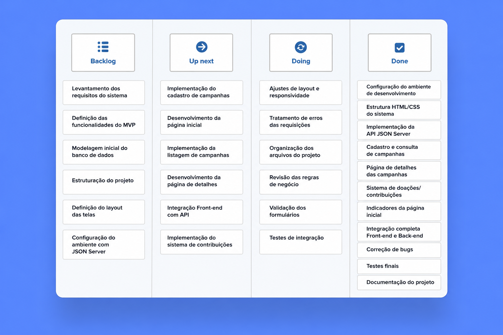

# Solução Implementada

Esta seção apresenta todos os detalhes da solução criada no projeto.

## Vídeo do Projeto

O vídeo a seguir traz uma apresentação do problema que a equipe está tratando e a proposta de solução. ⚠️ EXEMPLO ⚠️

[](https://www.youtube.com/embed/70gGoFyGeqQ)

> ⚠️ **APAGUE ESSA PARTE ANTES DE ENTREGAR SEU TRABALHO**
>
> O video de apresentação é voltado para que o público externo possa conhecer a solução. O formato é livre, sendo importante que seja apresentado o problema e a solução numa linguagem descomplicada e direta.
>
> Inclua um link para o vídeo do projeto.

## Funcionalidades

Esta seção apresenta as principais funcionalidades implementadas na plataforma Solidariza.

##### Funcionalidade 1 - Cadastro e Autenticação de Usuários

Permite criar conta e acessar a plataforma com controle de sessão para usuários comuns e administradores.

* **Estrutura de dados:** [Usuários](#estrutura-de-dados---usuarios)
* **Instruções de acesso:**
  * Acesse a tela de cadastro em `modulos/cadastro/cadastro.html`
  * Preencha os campos obrigatórios e confirme os termos
  * Faça login em `modulos/login/login.html`
* **Tela da funcionalidade:**

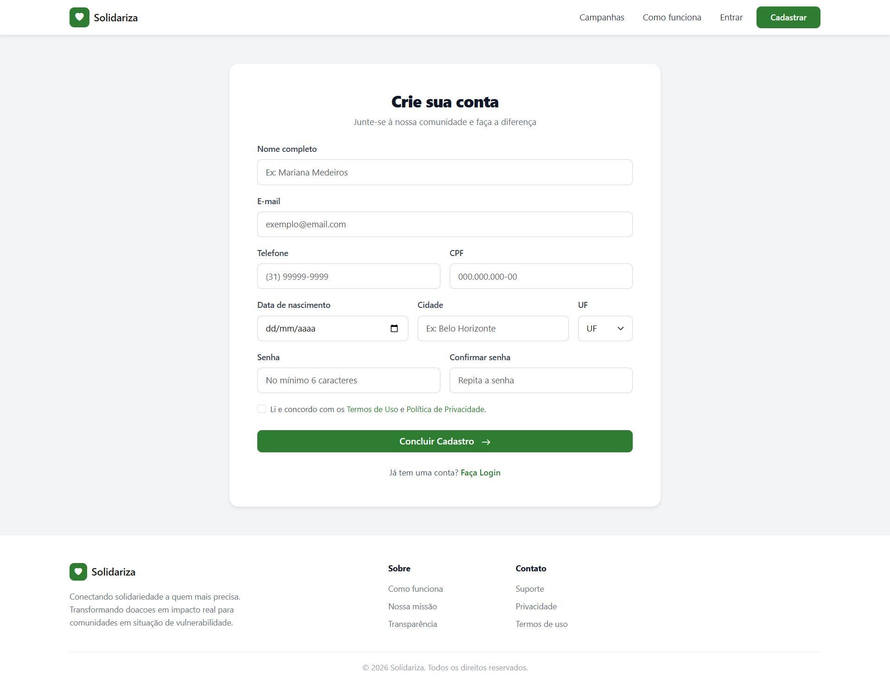
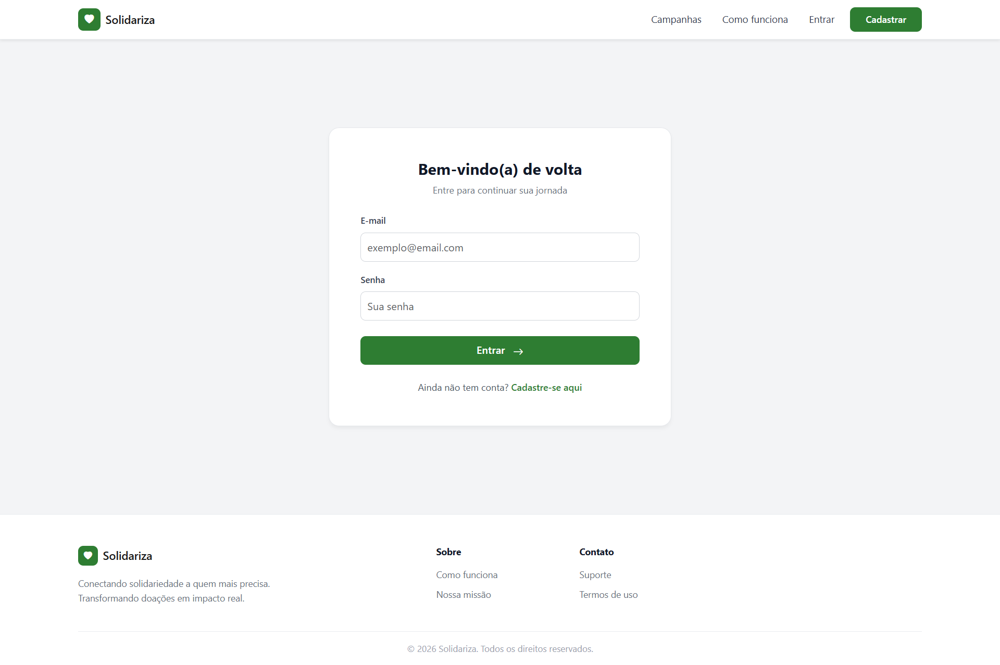

##### Funcionalidade 2 - Listagem, Filtros e Detalhe de Campanhas

Exibe campanhas com busca, filtros por categoria, painel de detalhes e progresso de arrecadação.

* **Estrutura de dados:** [Campanhas](#estrutura-de-dados---campanhas), [Contribuições](#estrutura-de-dados---contribuicoes), [Atualizações](#estrutura-de-dados---atualizacoes)
* **Instruções de acesso:**
  * Acesse `modulos/campanha/campanhas.html`
  * Utilize busca e filtros de categoria
  * Clique em uma campanha para abrir `detalhe-campanha.html?id=<id>`
* **Tela da funcionalidade:**

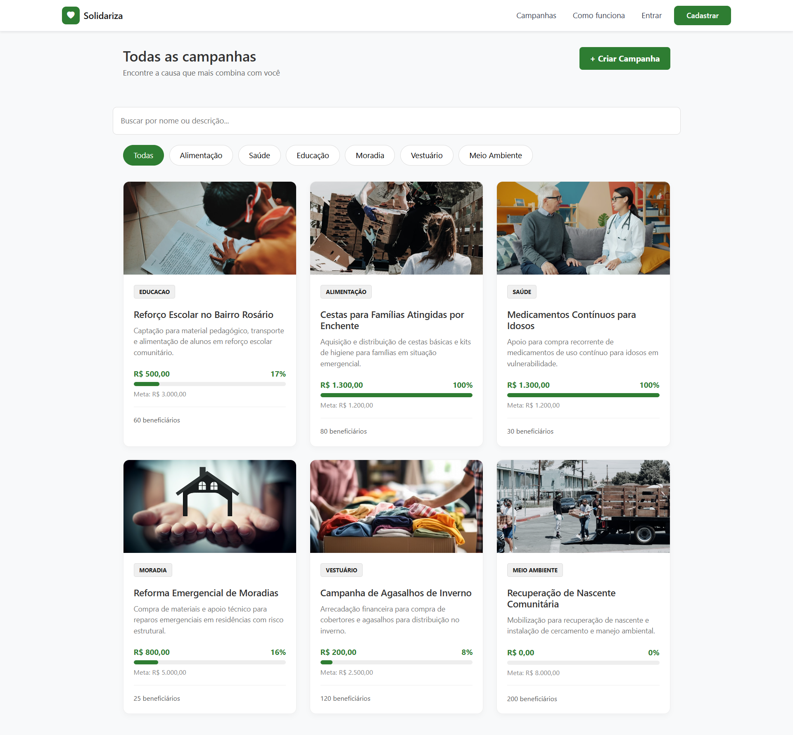
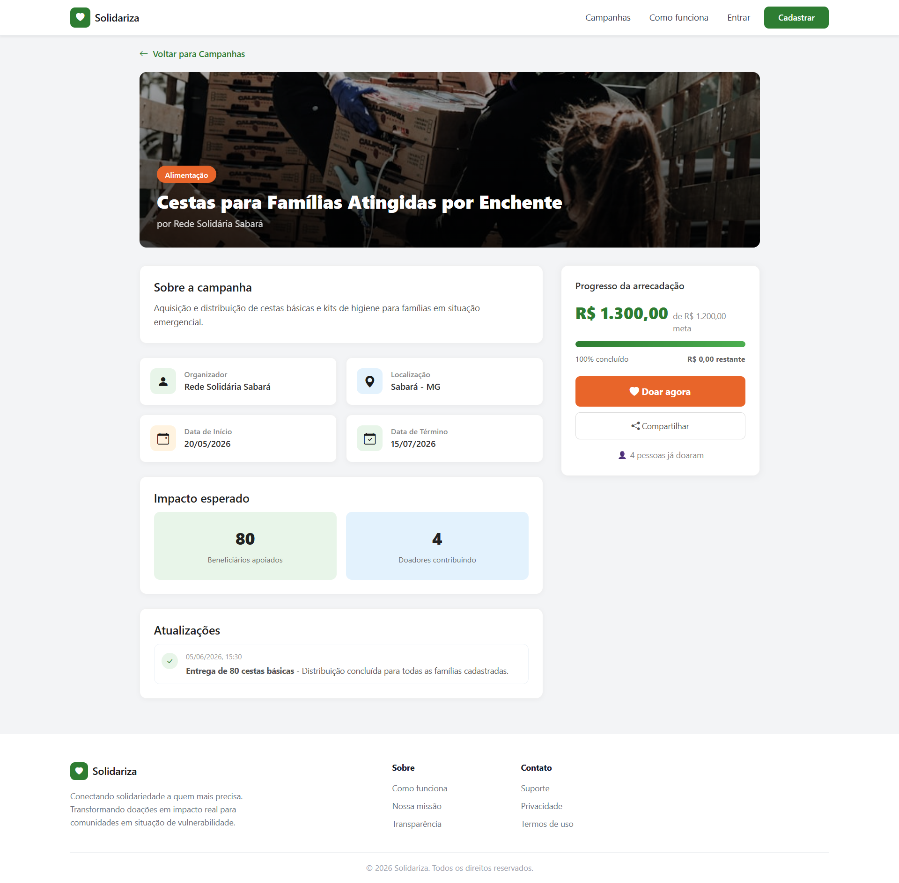

##### Funcionalidade 3 - Doação para Campanhas

Permite selecionar valor, preencher pagamento simulado e registrar contribuição com atualização do progresso da campanha.

* **Estrutura de dados:** [Contribuições](#estrutura-de-dados---contribuicoes), [Campanhas](#estrutura-de-dados---campanhas), [Avisos](#estrutura-de-dados---avisos)
* **Instruções de acesso:**
  * Acesse o detalhe da campanha e clique em **Doar agora**
  * Em `modulos/contribuicao/realizar-contribuicao.html?id=<id>`, informe valor e dados de pagamento
  * Confirme a doação
* **Tela da funcionalidade:**

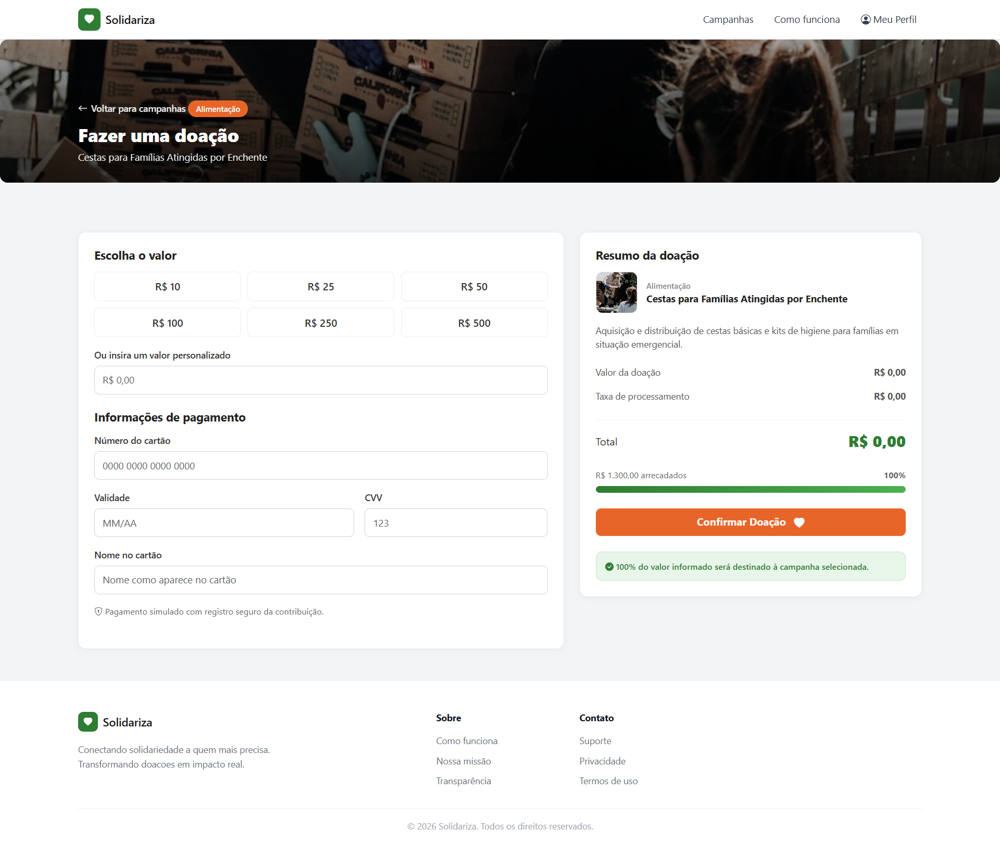

##### Funcionalidade 4 - Solicitações de Ajuda

Permite cadastrar solicitações, acompanhar status e criar campanhas vinculadas quando a solicitação está disponível.

* **Estrutura de dados:** [Solicitações](#estrutura-de-dados---solicitacoes), [Campanhas](#estrutura-de-dados---campanhas)
* **Instruções de acesso:**
  * Acesse `modulos/solicitacao/solicitacoes.html`
  * Para nova solicitação, utilize `criar-solicitacao.html`
  * Acompanhe status (`em_analise`, `disponivel`, `em_desenvolvimento`, `concluida`, `reprovada`)
* **Tela da funcionalidade:**

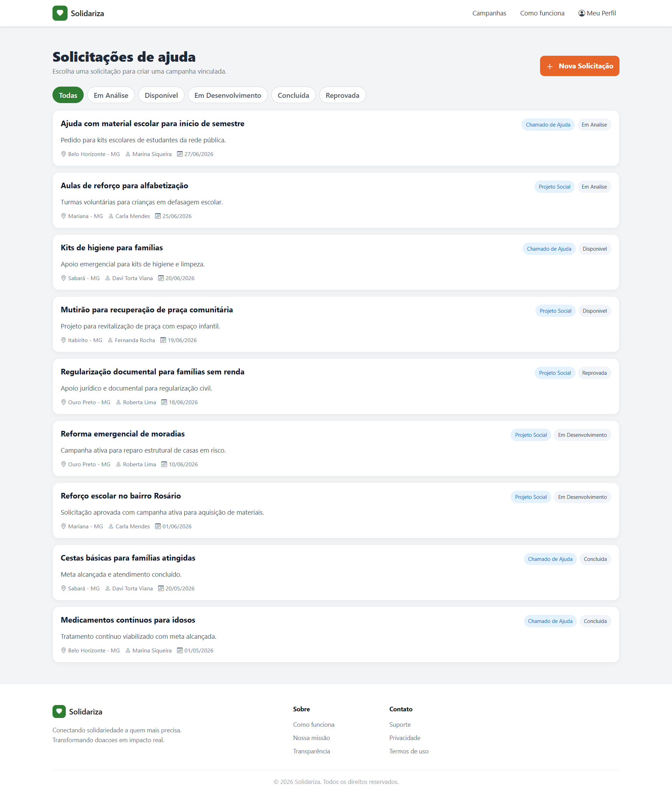

##### Funcionalidade 5 - Perfil do Usuário

Permite visualizar dados do usuário, resumo de impacto e preferências de configuração.

* **Estrutura de dados:** [Usuários](#estrutura-de-dados---usuarios), [Contribuições](#estrutura-de-dados---contribuicoes)
* **Instruções de acesso:**
  * Faça login
  * Acesse `modulos/perfil/perfil.html`
  * Consulte informações pessoais e preferências
* **Tela da funcionalidade:**

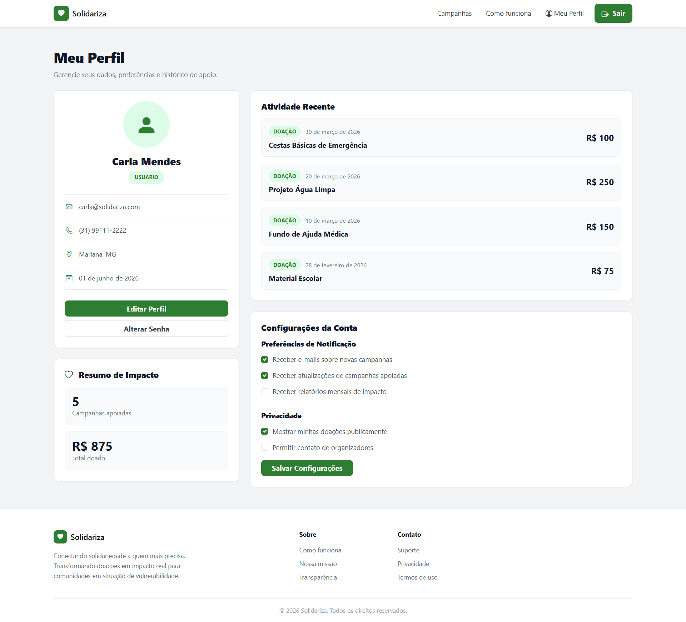

##### Funcionalidade 6 - Administração (Dashboard, Solicitações, Campanhas, Usuários e Avisos)

Permite gerenciamento administrativo de solicitações, campanhas, usuários e avisos operacionais da plataforma.

* **Estrutura de dados:** [Solicitações](#estrutura-de-dados---solicitacoes), [Campanhas](#estrutura-de-dados---campanhas), [Usuários](#estrutura-de-dados---usuarios), [Avisos](#estrutura-de-dados---avisos), [Atualizações](#estrutura-de-dados---atualizacoes)
* **Instruções de acesso:**
  * Faça login com perfil `admin`
  * Acesse `modulos/administrador/dashboard-admin.html`
  * Navegue por `solicitacoes-admin.html`, `campanhas-admin.html`, `usuarios-admin.html` e `avisos-admin.html`
* **Tela da funcionalidade:**

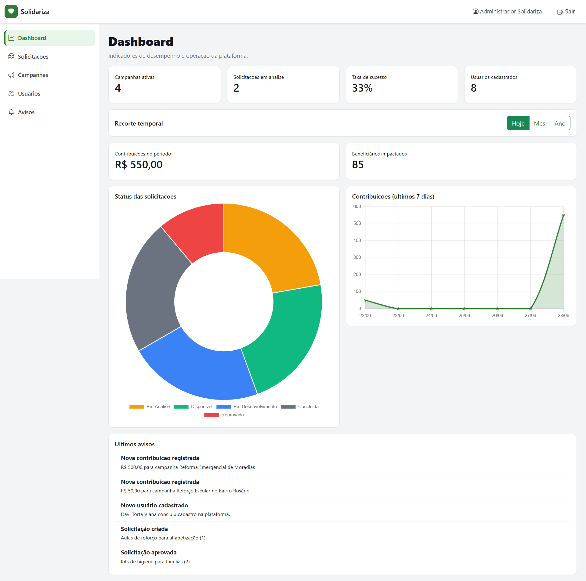

##### Funcionalidade 7 - Publicação de Atualizações da Campanha (Dono da campanha)

Permite ao criador da campanha registrar progresso e prestação de contas, além de visualizar o detalhamento da atualização.

* **Estrutura de dados:** [Atualizações](#estrutura-de-dados---atualizacoes), [Campanhas](#estrutura-de-dados---campanhas)
* **Instruções de acesso:**
  * Acesse `modulos/campanha/minhas-campanhas.html`
  * Abra o painel da campanha em `detalhe-campanha-admin.html?id=<id>`
  * Clique em **Registrar atualização** e preencha `criar-atualizacao.html?campanhaId=<id>`
* **Tela da funcionalidade:**

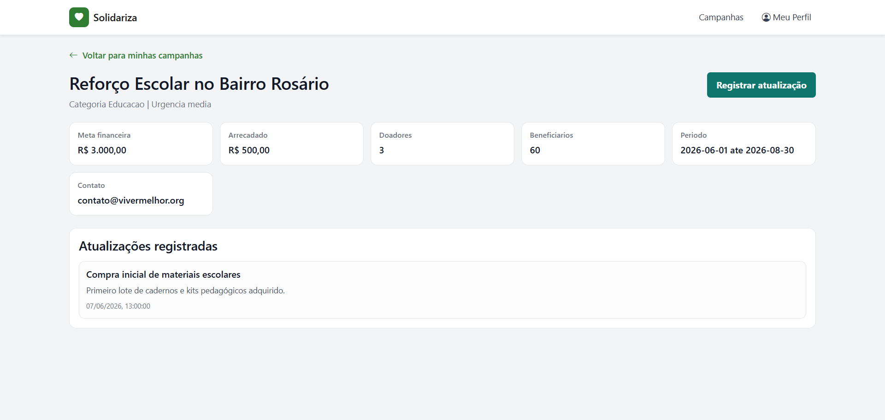
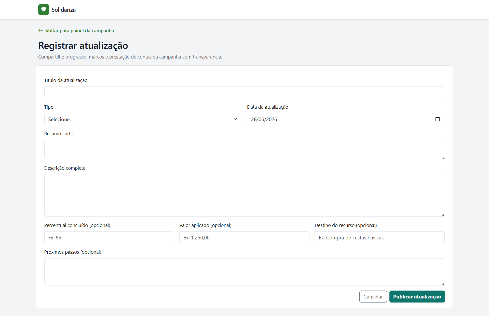
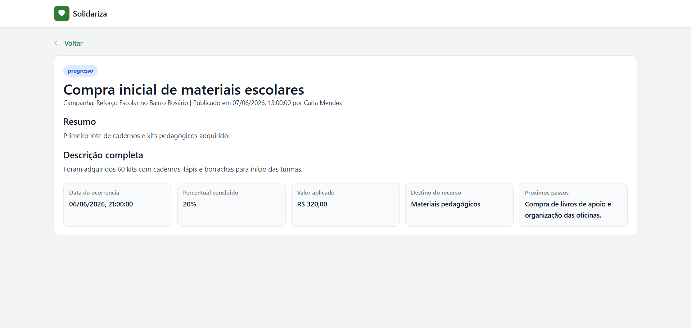

## Estruturas de Dados

Descrição das estruturas de dados utilizadas na solução com exemplos no formato JSON.

##### Estrutura de Dados - Usuarios

Registro de usuários da plataforma (admin e usuário comum), incluindo dados de sessão, perfil e preferências.

```json
{
  "id": 2,
  "nome": "Carla Mendes",
  "email": "carla@solidariza.com",
  "senha": "123456",
  "perfil": "usuario",
  "telefone": "31991112222",
  "documento": "11111111111",
  "dataNascimento": "1993-04-09",
  "cidade": "Mariana",
  "estado": "MG",
  "localizacao": "Mariana, MG",
  "ativo": true,
  "configuracoes": {
    "notifCampanhas": true,
    "notifAtualizacoes": true,
    "notifRelatorios": false,
    "privDoacoes": true,
    "privContato": false
  }
}
```

##### Estrutura de Dados - Solicitacoes

Solicitações de ajuda criadas por usuários, com status de análise e vínculo opcional com campanha.

```json
{
  "id": 4,
  "titulo": "Reforço escolar no bairro Rosário",
  "tipoSolicitacao": "projeto_social",
  "status": "em_desenvolvimento",
  "descricaoResumo": "Solicitação aprovada com campanha ativa para aquisição de materiais.",
  "local": "Mariana - MG",
  "categoriaAjuda": "educacao",
  "urgencia": "media",
  "numeroBeneficiarios": 60,
  "contatoNome": "Carla Mendes",
  "contatoEmail": "carla@solidariza.com",
  "criadorId": 2,
  "campanhaId": 1,
  "motivoReprovacao": null
}
```

##### Estrutura de Dados - Campanhas

Campanhas de arrecadação exibidas na plataforma, com metas, progresso, vínculo com solicitação e informações de contato.

```json
{
  "id": 1,
  "titulo": "Reforço Escolar no Bairro Rosário",
  "categoria": "Educacao",
  "descricao": "Captação para material pedagógico, transporte e alimentação de alunos em reforço escolar comunitário.",
  "meta": 3000,
  "arrecadado": 500,
  "doadores": 3,
  "beneficiarios": 60,
  "urgencia": "media",
  "solicitacaoId": 4,
  "criadorId": 2,
  "criadorNome": "Carla Mendes"
}
```

##### Estrutura de Dados - Contribuicoes

Registros de doações realizadas para campanhas, incluindo valor, data e dados de pagamento simulados.

```json
{
  "id": 18,
  "campanhaId": 1,
  "usuarioId": 2,
  "valor": 50,
  "criadoEm": "2026-06-28T20:40:07.079Z",
  "pagamento": {
    "cartaoFinal": "1111",
    "validade": "12/29",
    "nomeTitular": "Carla Mendes"
  }
}
```

##### Estrutura de Dados - Atualizacoes

Atualizações publicadas pelos responsáveis da campanha para prestação de contas e acompanhamento de progresso.

```json
{
  "id": 1,
  "campanhaId": 1,
  "titulo": "Compra inicial de materiais escolares",
  "tipo": "progresso",
  "dataOcorrencia": "2026-06-07",
  "resumo": "Primeiro lote de cadernos e kits pedagógicos adquirido.",
  "detalhes": "Foram adquiridos 60 kits com cadernos, lápis e borrachas para início das turmas.",
  "percentualConcluido": 20,
  "valorAplicado": 320,
  "destinoRecurso": "Materiais pedagógicos",
  "proximosPassos": "Compra de livros de apoio e organização das oficinas.",
  "autorId": 2,
  "autorNome": "Carla Mendes"
}
```

##### Estrutura de Dados - Avisos

Eventos relevantes persistidos para acompanhamento administrativo (cadastros, julgamentos, campanhas e contribuições).

```json
{
  "id": 11,
  "tipo": "contribuicao_realizada",
  "titulo": "Nova contribuicao registrada",
  "descricao": "R$ 50,00 para campanha Reforço Escolar no Bairro Rosário",
  "referenciaTipo": "campanha",
  "referenciaId": 1,
  "criadoEm": "2026-06-28T20:40:07.160Z"
}
```

## Módulos e APIs

Esta seção apresenta os módulos e APIs utilizados na solução.

**Frameworks e bibliotecas (front-end):**

* Bootstrap 5.3.3 (layout, grid e componentes): [https://getbootstrap.com/](https://getbootstrap.com/)
* Bootstrap Icons 1.11.3 (ícones): [https://icons.getbootstrap.com/](https://icons.getbootstrap.com/)

**Back-end e persistência local:**

* JSON Server 0.17.4 (API REST mock para desenvolvimento): [https://github.com/typicode/json-server](https://github.com/typicode/json-server)
* Banco local em arquivo JSON: `codigo/db/db.json`

**Módulos da solução:**

* Módulo público inicial: `modulos/index.html`
* Módulo de autenticação: `modulos/login/login.html` e `modulos/cadastro/cadastro.html`
* Módulo de campanhas: listagem, detalhe, minhas campanhas, criação e atualização
* Módulo de contribuições: `modulos/contribuicao/realizar-contribuicao.html`
* Módulo de solicitações: listagem e criação
* Módulo de perfil do usuário
* Módulo administrativo: dashboard, solicitações, campanhas, usuários e avisos

**APIs e serviços internos (camada de integração):**

* `api-config.js` (URL base da API)
* `auth-service.js` (sessão com Local Storage)
* `usuario-service.js` (CRUD de usuários)
* `campanha-service.js` (CRUD de campanhas)
* `solicitacao-service.js` (CRUD de solicitações)
* `contribuicao-service.js` (registro de contribuições)
* `atualizacao-service.js` (CRUD de atualizações)

**Endpoints REST consumidos (JSON Server):**

* `/usuarios`
* `/solicitacoes`
* `/campanhas`
* `/contribuicoes`
* `/atualizacoes`
* `/avisos`
* `/contatos`

# Referências

As referências utilizadas no trabalho foram:

* BOOTSTRAP. Bootstrap 5.3 - The world’s most popular framework for building responsive, mobile-first sites. Disponível em: [https://getbootstrap.com/](https://getbootstrap.com/). Acesso em: 28 jun. 2026.
* BOOTSTRAP ICONS. Official open source SVG icon library for Bootstrap. Disponível em: [https://icons.getbootstrap.com/](https://icons.getbootstrap.com/). Acesso em: 28 jun. 2026.
* MDN WEB DOCS. Using the Fetch API. Disponível em: [https://developer.mozilla.org/en-US/docs/Web/API/Fetch_API/Using_Fetch](https://developer.mozilla.org/en-US/docs/Web/API/Fetch_API/Using_Fetch). Acesso em: 28 jun. 2026.
* MDN WEB DOCS. Window: localStorage property. Disponível em: [https://developer.mozilla.org/en-US/docs/Web/API/Window/localStorage](https://developer.mozilla.org/en-US/docs/Web/API/Window/localStorage). Acesso em: 28 jun. 2026.
* TYPICODE. JSON Server. Disponível em: [https://github.com/typicode/json-server](https://github.com/typicode/json-server). Acesso em: 28 jun. 2026.
* W3SCHOOLS. JSON Introduction. Disponível em: [https://www.w3schools.com/js/js_json_intro.asp](https://www.w3schools.com/js/js_json_intro.asp). Acesso em: 28 jun. 2026.
